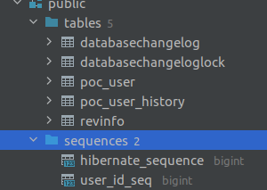
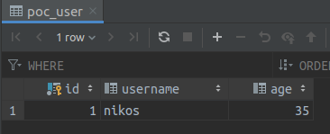
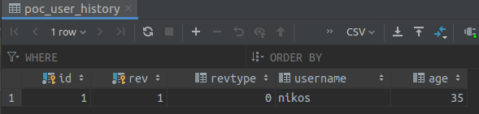
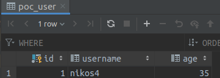
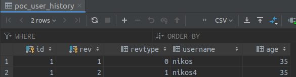
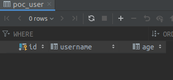
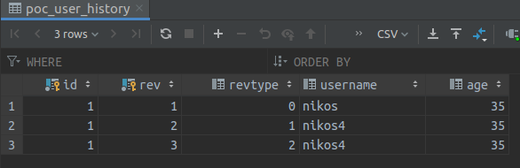

# Quarkus with Hibernate Envers and Liquibase Extensions

A small POC that uses 
* Quarkus
* Hibernate Envers, for audit tables
* Liquibase for manual setup

## Running the application in dev mode

Create the database with:
```shell script
docker-compose up
```

Run the application with:
```shell script
./gradlew quarkusDev
```
After that verify that the follwing tables and sequences have been created:



## Testing the application

Perform the follwoing requests (eg. through [Postman](https://www.postman.com/))

1) Create a user
```
POST
http://localhost:8080/user

body:
{
    "username":"nikos",
    "age":35
}

Response:
{
    "id": 1,
    "username": "nikos",
    "age": 35
}
```
Verify that the user and the audit record have been created in the DB




2) Update the username
```
PUT
http://localhost:8080/user

body:
{
    "id": 1,
    "username":"nikos4",
    "age":35
}

Response:
{
    "id": 1,
    "username": "nikos4",
    "age": 35
}
```


Verify that the user and the audit record have been updated in the DB




3) Delete the user
```
DELETE
http://localhost:8080/user

Response:
1
```

Verify that the user has been deleted from the main table and the audit table has been updated




4) Retrieve all of the audited entities through the API
```
GET
http://localhost:8080/user/history

Response:
[
    {
        "id": 1,
        "username": "nikos",
        "age": 35
    },
    {
        "id": 1,
        "username": "nikos4",
        "age": 35
    },
    {
        "id": 1,
        "username": "nikos4",
        "age": 35
    }
]
```